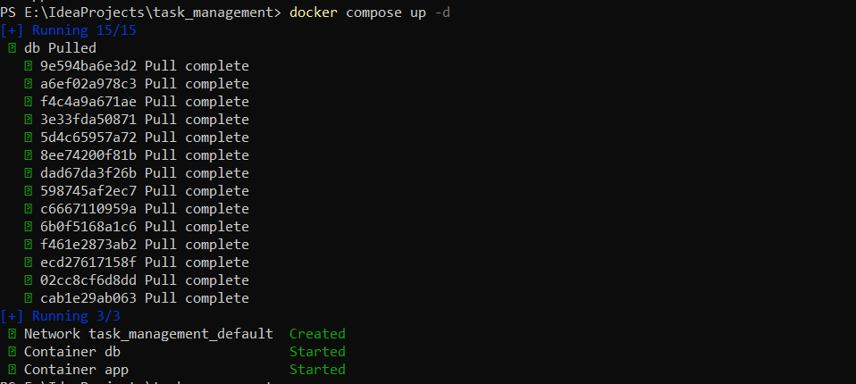

Краткое описание проекта
Это REST API приложение на Spring Boot для управления задачами (Tasks).
Позволяет создавать, получать, обновлять и удалять задачи с такими полями, как title, description и статус (PENDING, IN_PROGRESS, COMPLETED).
Реализована валидация данных и глобальная обработка ошибок с понятными HTTP ответами.

Примеры запросов к API
1. Создание новой задачи(POST /api/tasks).
* Если входные данные валидны, возвращается созданная задача с кодом 201 Created.
* Если входные данные некорректны, Spring автоматически вернёт 400 Bad Request.
* 

2.Получение задачи по ID(GET /api/tasks/{id})
* Если задача найдена — возвращается объект и статус 200 OK.

* Если задача не найдена — выбрасывается исключение и обрабатывается глобально (404).

3.Обновление задачи по ID(PUT /api/tasks/{id}).
* При успешном обновлении возвращается обновлённая задача и статус 200 OK.

* Если входные данные некорректны, Spring автоматически вернёт 400 Bad Request.

* Если задача не найдена — выбрасывается исключение и обрабатывается глобально (404).

4.Удаление задачи по ID(DELETE/tasks/{id})
* Если задача найдена и удалена — возвращается статус 204 No Content (без тела).

* Если задача не найдена — выбрасывается исключение и обрабатывается как 404.

Инструкция по запуску Docker-контейнера.

Необходимо собрать Java проект(mvn clean install). Собранный JAR-файл в папке target будет скопирован в 
образ приложения.

Расположение файлов:
Dockerfile и docker-compose.yml созданы в корневой директории проекта "task_management", рядом с папкой target. 

Запуск через Docker Compose:
1. Откройте терминал или командную строку.
2. Перейдите в директорию, где лежат Dockerfile и docker-compose.yml и выполните следующую команду:
* docker compose build

Эта команда пересоберет образ приложения
3. Дальше необходимо выполнить следующую команду, чтобы запустить все контейнеры из docker-compose.yml в "detached mode":
* docker compose up -d
* 

4. После выполнения предыдущей команды будут созданы два контейнера:
* app: Java-сервис, который теперь работает в своём изолированном окружении. Приложение будет доступно через браузер по адресу: http://localhost:8080.
* db: База данных PostgreSQL, также работающая в своём контейнере. Вы можете подключиться к базе данных PostgreSQL по адресу: localhost:5432.

    Все данные базы данных будут храниться в томе pgdata, что предотвращает их потерю при остановке или удалении контейнера db.

4. Полезные команды для работы с контейнерами:
4.1 Проверить статус запущенных контейнеров:
* docker compose ps
4.2 Посмотреть логи конкретного контейнера (например, app):
* docker compose logs -f app
4.3 Остановить и удалить запущенные контейнеры и связанные с ними сети (но сохранить данные в томе pgdata):
* docker compose down
4.4 Остановить и удалить контейнеры, сети, И ВСЕ ТОМА (включая pgdata — это удалит данные вашей базы!):
* docker compose down -v

Swagger

http://localhost:8080/swagger-ui/index.html#/